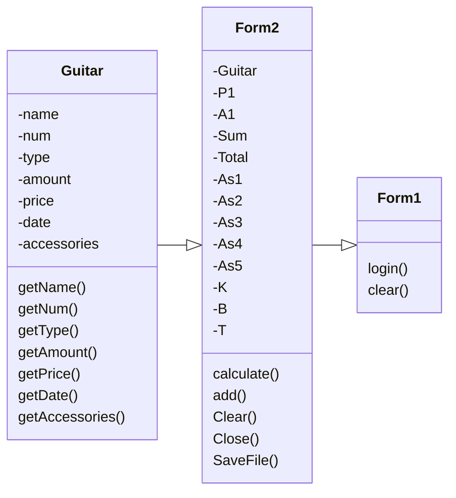

# Final_Project_643450076_9
Finalproject oop  
### วัตถุประสงค์ของโปรแกรม
ใช้ในการบันทึกและคำนวนข้อมูลเบื้ยงต้นในการซื้อ กีต้าร์  
### Class Diagram

```mermaid
classDiagram
direction RL
  Form2 <|-- Guitar
  Form1 <|-- Form2
class Form1{
  login()
  clear()
  }
class Form2{
  -Guitar
  -P1
  -A1
  -Sum
  -Total
  -As1
  -As2
  -As3
  -As4
  -As5
  -K
  -B
  -T
  calculate()
  add()
  Clear()
  Close()
  SaveFile()
  }
class Guitar{
  -name
  -num
  -type
  -amount
  -price
  -date
  -accessories
  getName()
  getNum()
  getType()
  getAmount()
  getPrice()
  getDate()
  getAccessories()
}
```
**ปฏิภัทร ดำทองสุก
